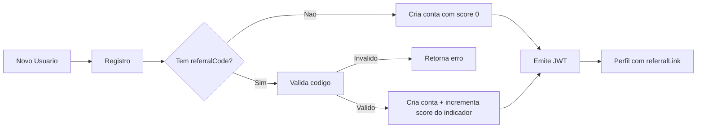

# 🎯 Sistema de Indicação (Referral System)

Uma aplicação web para cadastro/login com programa de indicação e pontuação automática por conversão.


---

## Conteúdo

- [Visão Geral](#visão-geral)
- [Stack e Ferramentas](#stack-e-ferramentas)
- [Arquitetura](#arquitetura)
- [Fluxo de Indicação](#fluxo-de-indicação)
- [Funcionalidades Centrais](#funcionalidades-centrais)
- [Métricas do Projeto](#métricas-do-projeto)
- [Pré-requisitos](#pré-requisitos)
- [Configuração Local](#configuração-local)
- [Scripts](#scripts)
- [Variáveis de Ambiente](#variáveis-de-ambiente)
- [Segurança](#segurança)
- [Práticas de Engenharia](#práticas-de-engenharia)
- [Autor](#autor)

## Visão Geral

### Objetivos

- Implementar autenticação moderna com JWT.
- Criar um mecanismo de indicação com código único por usuário.
- Atribuir pontuação automaticamente quando uma indicação gera novo cadastro.

### Situação em que o sistema se aplica

- Produtos com estratégia de aquisição via referral.
- MVPs que precisam validar mecânica de crescimento orientada a convite.
- Projetos educacionais para domínio de NestJS + React + TypeScript.

### Solução implementada

Backend modular em NestJS com TypeORM/SQLite e frontend em React + TypeScript. O fluxo de indicação é resolvido no registro: se o código for válido, o usuário indicador recebe incremento de score.

### Por que essa solução

- NestJS oferece estrutura forte para autenticação, módulos e validação.
- SQLite reduz custo operacional e acelera setup para demo/MVP.
- React + TypeScript melhora produtividade com tipagem e UI reativa.

## Stack e Ferramentas

### Backend

- NestJS 11
- TypeScript
- TypeORM 0.3
- SQLite3
- JWT (`@nestjs/jwt`)
- `class-validator`, `class-transformer`, `bcrypt`

### Frontend

- React 19
- TypeScript 5
- Vite 7
- React Router DOM 7
- Axios

### Qualidade

- ESLint
- Jest (backend)
- Prettier

## Arquitetura

```text
ReferralSystem/
  backend/
    src/
      auth/
      users/
      common/
      database/
      app.module.ts
      main.ts
  frontend/
    src/
      pages/
      components/
      contexts/
      services/
      utils/
      App.tsx
```

### Componentes principais

- `AuthModule`: registro, login, emissão de token.
- `UsersModule`: perfil e geração de link de indicação.
- `DatabaseModule`: conexão SQLite centralizada.
- Frontend com rotas públicas e rota protegida de perfil.

## Fluxo de Indicação



## Funcionalidades Centrais

- Registro com validação de nome, email e senha.
- Login com JWT e proteção de rotas.
- Código único de indicação por usuário.
- Link de indicação completo para compartilhamento.
- Pontuação automática no usuário indicador.
- Página de perfil com score e link de referral.
- Interface responsiva com feedback visual (loading/toast).

## Métricas do Projeto

Snapshot técnico da base atual:

- 27 arquivos TypeScript no backend.
- 22 arquivos TypeScript/TSX no frontend.
- 3 controllers no backend.
- 5 endpoints HTTP mapeados nos controllers principais.
- 1 entidade central (`User`) com relacionamento autorreferente.
- 4 páginas de interface (`Register`, `Login`, `Profile`, `NotFound`).

## Pré-requisitos

- Node.js 18+
- npm 9+

## Configuração Local

1. Clone:

```bash
git clone https://github.com/Shizuo0/ReferralSystem.git
cd ReferralSystem
```

2. Backend:

```bash
cd backend
npm install
cp .env.example .env
npm run start:dev
```

3. Frontend (novo terminal):

```bash
cd frontend
npm install
cp .env.example .env
npm run dev
```

URLs padrão:

- Backend: http://localhost:3000
- Frontend: http://localhost:5173

## Scripts

### Backend

- `npm run start:dev` execução em desenvolvimento.
- `npm run build` build da aplicação.
- `npm run start:prod` execução da build.
- `npm test` testes.
- `npm run db:reset` reset do SQLite.
- `npm run db:backup` backup do banco local.

### Frontend

- `npm run dev` desenvolvimento.
- `npm run build` build de produção.
- `npm run preview` preview do build.
- `npm run lint` lint do frontend.

## Variáveis de Ambiente

### Backend (`backend/.env`)

```env
PORT=3000
FRONTEND_URL=http://localhost:5173
JWT_SECRET=your-super-secret-jwt-key-change-this-in-production
JWT_EXPIRES_IN=24h
```

### Frontend (`frontend/.env`)

```env
VITE_API_URL=http://localhost:3000
```

## Segurança

- Senhas armazenadas com hash (`bcrypt`).
- Validação global com `ValidationPipe` (`whitelist` + `forbidNonWhitelisted`).
- JWT para autenticação stateless.
- Guards e decorators customizados (`@Public`, `@CurrentUser`).
- CORS restrito por variável de ambiente.

## Práticas de Engenharia

- Arquitetura modular no backend.
- Separação de domínio (`auth`, `users`, `common`).
- Tipagem end-to-end com TypeScript.
- Tratamento padronizado de exceções.
- Lazy loading e contexts no frontend.

## Autor

**Paulo Shizuo Vasconcelos Tatibana**

- GitHub: https://github.com/Shizu0n
- Email: paulosvtatibana@gmail.com
